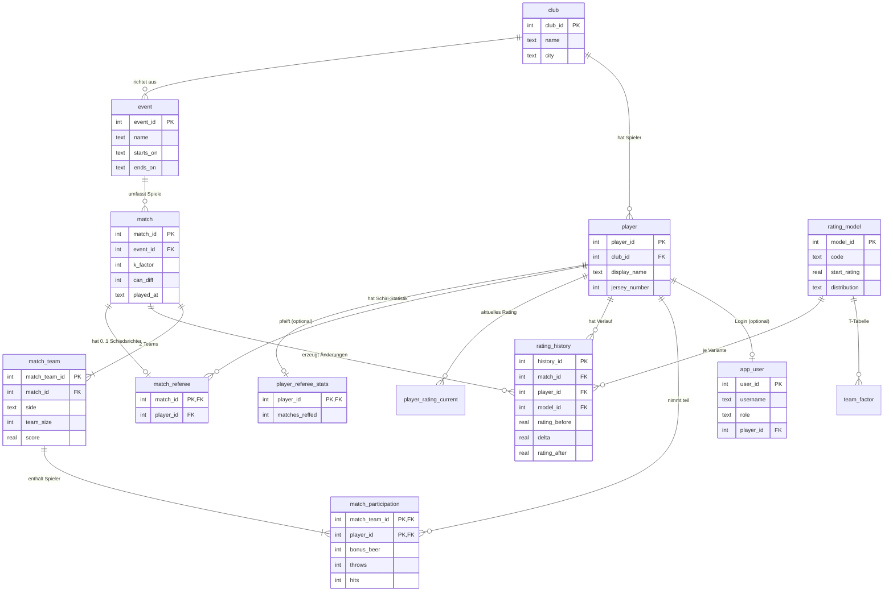

# Flunkyreifen ELO-Wertung — Vorschlag Datenbankstruktur

Vorschlag für ein relationales Schema (PostgreSQL, lokal auch SQLite), das **zwei
Quellen** zusammenführt:

1. Die Elo-Mechanik aus [flunkyreifen_test.py](flunkyreifen_test.py) und
   [FORMELN.md](FORMELN.md) — hier ausschließlich **Modell v3** (gemeinsamer,
   nullsummen-neutraler Größenfaktor `size_factor_v2`, gedämpfter Teamfaktor T,
   Gleichverteilung $P/n$ auf die Spieler).
2. Das App-Datenmodell aus dem Repo **[Seyda92/frc-elo](https://github.com/Seyda92/frc-elo)**
   (`elo-app.md`) — Vereine, Spieltage/Events, Nutzer/Login, Trefferquoten,
   Multi-Verein-Struktur und die Offline-/Sync-Anforderung (Raspberry Pi ↔ Cloud).

Der Next.js-Prototyp (Phase 0) nutzt bislang nur Dummy-Daten (kein Backend, keine
Persistenz). Dieses Schema ist der Vorschlag für die persistente Schicht ab Phase 1.

**Geklärte Punkte aus der letzten Runde:**

- **Teamgröße:** 1–20 Spieler pro Team (statt 4–10 aus dem Python-Modell bzw.
  3–5 aus `elo-app.md`). Das Modell v3 hat keinen Pol mehr (anders als v1), ist
  also für kleine Teamgrößen unproblematisch.
- **Nur v3:** es gibt keine `rating_model`-Auswahl mehr im Schema — die Formel
  ist fest v3. Trotzdem bleibt eine schlanke `rating_model`-Tabelle bestehen,
  falls später doch mal eine zweite Variante nötig wird; sie enthält aber nur
  noch die v3-Parameter.
- **Bonusbier = Strafbier:** ein und dasselbe Feld ($B_i$, mindernder Faktor
  $1-0{,}1B_i$ in der Formel). Es wird durchgehend als **`bonus_beer`**
  bezeichnet (Spalte, Doku), auch wenn es mathematisch strafend wirkt.
- **Elo turnierübergreifend:** ja — siehe eigener Abschnitt
  [„Rating über Turniere hinweg"](#rating-über-turniere-spieltage-hinweg) unten.

---

## Abgleich mit dem App-Modell (verbleibende offene Punkte)

| Aspekt | Python-Modell (v3) | App-Modell (`elo-app.md`) | Umsetzung im Schema |
|---|---|---|---|
| Teamgröße | jetzt 1–20 (siehe oben) | 3–5, „gleiche Größe" | `team_size` frei bis 20; „gleiche Größe" bleibt Sache der App-Logik |
| Ergebnis $S$ | 1 / 0.5 / 0 (Remis erlaubt) | binär (Sieg/Niederlage) | `score` erlaubt 0/0.5/1, App kann Remis verbieten |
| Bonusbier | $B_i$ 0..10, mindernd | „Bonusbiere" | jetzt einheitlich `bonus_beer`, 0..10 |
| Trefferquote | nicht vorhanden | Würfe/Treffer pro Spiel | eigene Spalten in `match_participation` |
| Verein / Event / Login | nicht vorhanden | zentral | eigene Tabellen ergänzt |

---

## Überblick der Tabellen

**App-Domäne (aus `elo-app.md`):**

| Tabelle | Zweck |
|---|---|
| `club` | Verein (Name, Ort) |
| `player` | Spieler-Stammdaten (Name, Rückennummer, Verein) |
| `app_user` | Login (Benutzername, Passwort-Hash, Rolle Admin/User) |
| `event` | Spieltag/Event (Name, Zeitraum) |

**Elo-/Match-Domäne (aus dem Python-Modell):**

| Tabelle | Zweck |
|---|---|
| `rating_model` | Modellparameter (fest v3 — Größenfaktor-Offset, Provisional-Faktor) |
| `team_factor` | Teamfaktor-Tabelle T (v3, gedämpft) |
| `match` | Ein Spiel: K, Dosenunterschied, Zeitpunkt, Event |
| `match_team` | Die zwei Teams eines Matches (Seite A/B), Größe, Ergebnis S |
| `match_participation` | Spieler → Team, Bonusbier, Wurfstatistik |
| `match_referee` | Schiedsrichter eines Matches (optional, 0 oder 1 pro Match) |
| `player_referee_stats` | Cache: Anzahl geleiteter Partien je Spieler |
| `rating_history` | Wertungsänderung je Spieler & Match (append-only Wahrheit) |
| `player_rating_current` | Cache: aktuelles Rating je Spieler — **turnier-/eventübergreifend** |

Kernidee: **`rating_history` ist die Wahrheit** (jede einzelne $\Delta R_i$),
`player_rating_current` ist nur eine performante, jederzeit neu berechenbare
Zusammenfassung. Da beide Tabellen **nicht** nach Event/Turnier aufgeteilt sind,
sondern nur nach `player_id`, nimmt jeder Spieler sein Rating automatisch von
einem Turnier ins nächste mit — siehe
[„Rating über Turniere hinweg"](#rating-über-turniere-spieltage-hinweg).

---

## DDL (SQL)

```sql
-- ===========================================================================
-- APP-DOMÄNE (aus elo-app.md: Verein, Event, Login)
-- ===========================================================================

CREATE TABLE club (
    club_id      INTEGER GENERATED ALWAYS AS IDENTITY PRIMARY KEY,
    name         TEXT NOT NULL,
    city         TEXT
);

CREATE TABLE player (
    player_id     INTEGER GENERATED ALWAYS AS IDENTITY PRIMARY KEY,
    club_id       INTEGER REFERENCES club(club_id),
    display_name  TEXT        NOT NULL,
    jersey_number INTEGER,                          -- Rückennummer
    joined_at     TIMESTAMPTZ NOT NULL DEFAULT now(),
    is_active     INTEGER     NOT NULL DEFAULT 1,
    UNIQUE (club_id, jersey_number)
);

CREATE TABLE app_user (
    user_id       INTEGER GENERATED ALWAYS AS IDENTITY PRIMARY KEY,
    username      TEXT NOT NULL UNIQUE,
    password_hash TEXT NOT NULL,
    role          TEXT NOT NULL DEFAULT 'user',     -- 'admin' | 'user'
    player_id     INTEGER REFERENCES player(player_id),  -- optional verknüpft
    CHECK (role IN ('admin','user'))
);

CREATE TABLE event (
    event_id     INTEGER GENERATED ALWAYS AS IDENTITY PRIMARY KEY,
    name         TEXT NOT NULL,
    starts_on    DATE,                              -- Wochenende oder länger
    ends_on      DATE,
    club_id      INTEGER REFERENCES club(club_id)
);

-- ===========================================================================
-- ELO-/MATCH-DOMÄNE (aus flunkyreifen_test.py / FORMELN.md)
-- ===========================================================================

-- Modellparameter, fest auf v3 (Gleichverteilung P/n, nullsummen-neutral).
-- Eine einzige Zeile ('v3'); Tabelle bleibt bestehen, falls spaeter doch
-- eine zweite Variante noetig wird, erzwingt aber aktuell keine Auswahl.
CREATE TABLE rating_model (
    model_id            INTEGER       GENERATED ALWAYS AS IDENTITY PRIMARY KEY,
    code                TEXT          NOT NULL UNIQUE DEFAULT 'v3',
    description         TEXT          NOT NULL DEFAULT 'v3: nullsummen-neutral, Gleichverteilung P/n',
    start_rating        NUMERIC(10,4) NOT NULL DEFAULT 200,
    size_factor_offset  NUMERIC(10,4) NOT NULL DEFAULT 7.0,  -- c in (n+D)/(n+c)
    is_zero_sum         INTEGER       NOT NULL DEFAULT 1,
    distribution        TEXT          NOT NULL DEFAULT 'equal',  -- v3 = Gleichverteilung P/n
    provisional_games   INTEGER       NOT NULL DEFAULT 15,
    provisional_k_boost NUMERIC(10,4) NOT NULL DEFAULT 3.0,
    CHECK (code = 'v3')
);

-- Teamfaktor-Tabelle T (v3, gedaempft). Groessendifferenz bis 19 moeglich,
-- da Teams jetzt 1..20 Spieler gross sein duerfen (>19 wird auf 19 gedeckelt).
CREATE TABLE team_factor (
    model_id  INTEGER       NOT NULL REFERENCES rating_model(model_id),
    size_diff INTEGER       NOT NULL,                     -- 1..19 (>19 auf 19 gedeckelt)
    factor    NUMERIC(10,6) NOT NULL,
    PRIMARY KEY (model_id, size_diff)
);

-- Match: ein gespieltes Spiel; speichert alle Eingangsgrößen zur Nachrechnung
CREATE TABLE match (
    match_id   INTEGER     GENERATED ALWAYS AS IDENTITY PRIMARY KEY,
    event_id   INTEGER     REFERENCES event(event_id),  -- Zuordnung Spieltag
    played_at  TIMESTAMPTZ NOT NULL DEFAULT now(),
    k_factor   INTEGER     NOT NULL,                     -- K in {50,40,30,20}
    can_diff   INTEGER     NOT NULL DEFAULT 0,           -- D (Dosenunterschied, >=0)
    note       TEXT
);

-- Die zwei Seiten (Teams) eines Matches
CREATE TABLE match_team (
    match_team_id INTEGER      GENERATED ALWAYS AS IDENTITY PRIMARY KEY,
    match_id      INTEGER      NOT NULL REFERENCES match(match_id) ON DELETE CASCADE,
    side          TEXT         NOT NULL,                  -- 'A' | 'B'
    team_size     INTEGER      NOT NULL,                  -- n, 1..20 Spieler
    score         NUMERIC(2,1) NOT NULL,                  -- S: 1 / 0 (kein Remis)
    UNIQUE (match_id, side),
    CHECK (side IN ('A','B')),
    CHECK (score IN (0, 1)),
    CHECK (team_size BETWEEN 1 AND 20)
);

-- Teilnahme: Spieler in Team, Bonusbier + Wurfstatistik (aus elo-app.md).
-- "Bonusbier" ist die App-Bezeichnung fuer B_i aus der Formel (mindernder
-- Faktor 1-0.1*B_i) - trotz des Namens dasselbe, mindernde Feld.
CREATE TABLE match_participation (
    match_team_id INTEGER NOT NULL REFERENCES match_team(match_team_id) ON DELETE CASCADE,
    player_id     INTEGER NOT NULL REFERENCES player(player_id),
    bonus_beer    INTEGER NOT NULL DEFAULT 0,        -- B_i, 0..10 (mindert dR_i)
    throws        INTEGER,                           -- Würfe (Trefferquote)
    hits          INTEGER,                           -- Treffer
    PRIMARY KEY (match_team_id, player_id),
    CHECK (bonus_beer BETWEEN 0 AND 10),
    CHECK (hits IS NULL OR throws IS NULL OR hits <= throws)
);

-- Schiedsrichter eines Matches: optional (ein Match funktioniert auch ohne),
-- hoechstens einer pro Match. Jeder Spieler kann Schiedsrichter sein, aber
-- nicht in einem Match, in dem er selbst mitspielt (siehe CHECK/Trigger unten).
CREATE TABLE match_referee (
    match_id  INTEGER PRIMARY KEY REFERENCES match(match_id) ON DELETE CASCADE,
    player_id INTEGER NOT NULL REFERENCES player(player_id)
);

-- Erzwingt "nicht im eigenen Team": ein Spieler, der in match_participation
-- fuer dieses match_id auftaucht, darf nicht gleichzeitig dessen
-- match_referee.player_id sein. In Postgres als CHECK-Constraint nicht direkt
-- moeglich (kein Zugriff auf andere Tabellen) - daher als Trigger:
CREATE OR REPLACE FUNCTION check_referee_not_participant() RETURNS trigger AS $$
BEGIN
    IF EXISTS (
        SELECT 1
        FROM   match_participation mp
        JOIN   match_team mt ON mt.match_team_id = mp.match_team_id
        WHERE  mt.match_id  = NEW.match_id
        AND    mp.player_id = NEW.player_id
    ) THEN
        RAISE EXCEPTION 'Spieler % ist Teilnehmer von Match % und kann dort nicht Schiedsrichter sein',
            NEW.player_id, NEW.match_id;
    END IF;
    RETURN NEW;
END;
$$ LANGUAGE plpgsql;

CREATE TRIGGER trg_referee_not_participant
    BEFORE INSERT OR UPDATE ON match_referee
    FOR EACH ROW EXECUTE FUNCTION check_referee_not_participant();

-- Umgekehrte Richtung (ein Teilnehmer darf nicht nachtraeglich zum
-- Schiedsrichter desselben Matches werden) ueber denselben Mechanismus
-- auf match_participation:
CREATE OR REPLACE FUNCTION check_participant_not_referee() RETURNS trigger AS $$
DECLARE
    v_match_id INTEGER;
BEGIN
    SELECT mt.match_id INTO v_match_id
    FROM   match_team mt WHERE mt.match_team_id = NEW.match_team_id;

    IF EXISTS (
        SELECT 1 FROM match_referee r
        WHERE r.match_id = v_match_id AND r.player_id = NEW.player_id
    ) THEN
        RAISE EXCEPTION 'Spieler % ist Schiedsrichter von Match % und kann dort nicht teilnehmen',
            NEW.player_id, v_match_id;
    END IF;
    RETURN NEW;
END;
$$ LANGUAGE plpgsql;

CREATE TRIGGER trg_participant_not_referee
    BEFORE INSERT OR UPDATE ON match_participation
    FOR EACH ROW EXECUTE FUNCTION check_participant_not_referee();

-- Cache: Anzahl geleiteter Partien je Spieler (aus match_referee ableitbar,
-- analog zu player_rating_current). Spart bei Ranglisten/Profilseiten das
-- Zaehlen von match_referee bei jedem Aufruf.
CREATE TABLE player_referee_stats (
    player_id      INTEGER     PRIMARY KEY REFERENCES player(player_id),
    matches_reffed INTEGER     NOT NULL DEFAULT 0,
    updated_at     TIMESTAMPTZ NOT NULL DEFAULT now()
);

-- Haelt player_referee_stats automatisch synchron mit match_referee, egal ob
-- ueber die App oder direkt per SQL eingetragen wird.
CREATE OR REPLACE FUNCTION sync_referee_stats() RETURNS trigger AS $$
BEGIN
    IF TG_OP = 'INSERT' THEN
        INSERT INTO player_referee_stats (player_id, matches_reffed, updated_at)
        VALUES (NEW.player_id, 1, now())
        ON CONFLICT (player_id) DO UPDATE
            SET matches_reffed = player_referee_stats.matches_reffed + 1,
                updated_at     = now();
    ELSIF TG_OP = 'DELETE' THEN
        UPDATE player_referee_stats
        SET    matches_reffed = matches_reffed - 1, updated_at = now()
        WHERE  player_id = OLD.player_id;
    ELSIF TG_OP = 'UPDATE' AND NEW.player_id <> OLD.player_id THEN
        UPDATE player_referee_stats
        SET    matches_reffed = matches_reffed - 1, updated_at = now()
        WHERE  player_id = OLD.player_id;
        INSERT INTO player_referee_stats (player_id, matches_reffed, updated_at)
        VALUES (NEW.player_id, 1, now())
        ON CONFLICT (player_id) DO UPDATE
            SET matches_reffed = player_referee_stats.matches_reffed + 1,
                updated_at     = now();
    END IF;
    RETURN NEW;
END;
$$ LANGUAGE plpgsql;

CREATE TRIGGER trg_sync_referee_stats
    AFTER INSERT OR UPDATE OR DELETE ON match_referee
    FOR EACH ROW EXECUTE FUNCTION sync_referee_stats();

-- Rating-Verlauf: append-only Wahrheit (rating_before + delta = rating_after).
-- WICHTIG fuer Turnieruebergreifendes Rating: kein event_id/tournament_id
-- hier - der Verlauf ist eine einzige, fortlaufende Kette pro Spieler ueber
-- ALLE Matches und Events hinweg. match.event_id ordnet nur zu, WELCHEM
-- Turnier ein Match angehoerte; es startet keine neue Rating-Kette.
CREATE TABLE rating_history (
    history_id     INTEGER       GENERATED ALWAYS AS IDENTITY PRIMARY KEY,
    match_id       INTEGER       NOT NULL REFERENCES match(match_id) ON DELETE CASCADE,
    player_id      INTEGER       NOT NULL REFERENCES player(player_id),
    model_id       INTEGER       NOT NULL REFERENCES rating_model(model_id),  -- immer 'v3'
    rating_before  NUMERIC(10,4) NOT NULL,
    delta          NUMERIC(10,4) NOT NULL,                 -- dR_i
    rating_after   NUMERIC(10,4) NOT NULL,
    games_played   INTEGER       NOT NULL,                 -- g VOR diesem Match (ueber alle Turniere gezaehlt)
    UNIQUE (match_id, player_id, model_id)
);

-- Cache: aktuelles Rating je Spieler (aus rating_history ableitbar).
-- Ein Datensatz pro Spieler, NICHT pro Event/Turnier - das ist der Kern der
-- Turnieruebergreifenden Mitnahme: player_rating_current.rating ist immer
-- der neueste rating_after-Wert ueber die gesamte Karriere des Spielers.
CREATE TABLE player_rating_current (
    player_id     INTEGER       NOT NULL REFERENCES player(player_id),
    model_id      INTEGER       NOT NULL REFERENCES rating_model(model_id),  -- immer 'v3'
    rating        NUMERIC(10,4) NOT NULL,
    games_played  INTEGER       NOT NULL DEFAULT 0,
    wins          INTEGER       NOT NULL DEFAULT 0,        -- Statistik (elo-app.md)
    losses        INTEGER       NOT NULL DEFAULT 0,
    draws         INTEGER       NOT NULL DEFAULT 0,
    updated_at    TIMESTAMPTZ   NOT NULL DEFAULT now(),
    PRIMARY KEY (player_id, model_id)
);

-- Indizes für typische Abfragen
CREATE INDEX idx_history_player_model ON rating_history(player_id, model_id);
CREATE INDEX idx_history_match        ON rating_history(match_id);
CREATE INDEX idx_participation_player ON match_participation(player_id);
CREATE INDEX idx_match_event          ON match(event_id);
CREATE INDEX idx_player_club          ON player(club_id);
```

---

## Beziehungen (ER-Diagramm)



---

## Rating über Turniere (Spieltage) hinweg

**Ja, das Schema ist genau darauf ausgelegt.** Das Rating ist strikt an
`player_id` gebunden, nicht an `event_id`:

- `rating_history` reiht **jedes** Match eines Spielers in eine einzige,
  fortlaufende Kette — unabhängig davon, zu welchem `event` (Turnier/Spieltag)
  das Match gehört. `match.event_id` ist nur eine Zuordnung/Filtermöglichkeit
  ("welche Spiele fanden an diesem Wochenende statt"), keine Rating-Grenze.
- `player_rating_current.rating` ist **ein** Wert pro Spieler (Primärschlüssel
  ist `player_id`, nicht `player_id + event_id`). Das nächste Turnier eines
  Spielers beginnt also automatisch mit dem Rating, das er beim letzten Match
  des vorherigen Turniers erreicht hatte — kein Reset.
- `games_played` (in `rating_history` und `player_rating_current`) zählt über
  die gesamte Karriere, nicht pro Turnier — wichtig für den Provisional-Faktor
  $m(g)$, der nach 15 Spielen *insgesamt* abklingt, nicht nach 15 Spielen pro
  Event.

**Konkret:** Spieler X spielt beim Frühjahrsturnier (Event 1) fünf Matches und
steht danach bei Rating 235. Beim Sommerturnier (Event 2) zwei Monate später
wird sein erstes Match dort mit `rating_before = 235` berechnet — nicht mit dem
Startwert 200. Wer nur an einem Event bestimmter Spieler ein eigenständiges,
zurückgesetztes Turnier-Rating braucht (z. B. für ein K.-o.-Turnier "nur unter
sich"), müsste das als **separates Konzept** ergänzen (z. B. eine
`tournament_rating`-Tabelle analog zu `player_rating_current`, aber mit
`event_id` im Schlüssel) — das ist im aktuellen Schema bewusst *nicht*
enthalten, weil `elo-app.md` ein durchgehendes Leaderboard beschreibt.

---

## Wie die Struktur das Modell abbildet

| Formel / Konzept | Ort in der DB |
|---|---|
| $R_i$ Spielerwertung | `rating_history.rating_after`, `player_rating_current.rating` |
| $R_A, R_B$ Teamsumme | zur Laufzeit aus Teilnehmern eines `match_team` summiert |
| $S$ Ergebnis | `match_team.score` |
| $K$ Spielgewichtung | `match.k_factor` |
| $n$ Teamgröße | `match_team.team_size` |
| $D$ Dosenunterschied | `match.can_diff` |
| $B_i$ Bonusbier | `match_participation.bonus_beer` |
| $T$ Teamfaktor | `team_factor` (v3, nach Größendifferenz) |
| $\Delta R_i$ Änderung | `rating_history.delta` |
| Provisional-Faktor $m(g)$ | `rating_history.games_played` (karriereweit) + `rating_model.provisional_*` |
| Trefferquote (elo-app.md) | `match_participation.throws` / `hits` |
| Vereins-/Event-Struktur | `club`, `event`, `match.event_id` |
| Rollen/Login (elo-app.md) | `app_user.role` |

---

## Beispiel-Abfragen

**Leaderboard eines Vereins (turnierübergreifend, aktueller Stand):**

```sql
SELECT p.display_name, c.rating, c.games_played, c.wins, c.losses
FROM   player_rating_current c
JOIN   player p       ON p.player_id = c.player_id
WHERE  p.club_id = :club_id AND p.is_active = 1
ORDER  BY c.rating DESC;
```

**Ratingverlauf eines Spielers über alle Turniere hinweg (für `/spieler/[id]`):**

```sql
SELECT h.match_id, mm.played_at, mm.event_id, h.rating_before, h.delta, h.rating_after
FROM   rating_history h
JOIN   match mm ON mm.match_id = h.match_id
WHERE  h.player_id = :player_id
ORDER  BY mm.played_at;   -- eine durchgehende Kette, kein Reset pro event_id
```

**Rating eines Spielers zu Beginn eines bestimmten Turniers** (das Rating,
mit dem er in Event X startete — der letzte `rating_after`-Wert vor dessen
erstem Match):

```sql
SELECT h.rating_before
FROM   rating_history h
JOIN   match mm ON mm.match_id = h.match_id
WHERE  h.player_id = :player_id AND mm.event_id = :event_id
ORDER  BY mm.played_at ASC
LIMIT  1;
```

**Würfe, Treffer und Bonusbiere je Match für einen Spieler** (Rohdaten,
direkt ablesbar — beantwortet die Frage "kann man das pro Spieler auslesen?"
mit ja, jede Zeile ist ein Match):

```sql
SELECT mm.match_id, mm.played_at, mp.throws, mp.hits, mp.bonus_beer
FROM   match_participation mp
JOIN   match_team mt ON mt.match_team_id = mp.match_team_id
JOIN   match mm       ON mm.match_id      = mt.match_id
WHERE  mp.player_id = :player_id
ORDER  BY mm.played_at;
```

**Aggregierte Statistik eines Spielers (Trefferquote gesamt, Bonusbiere gesamt):**

```sql
SELECT
    SUM(hits)  * 1.0 / NULLIF(SUM(throws), 0) AS hit_rate,
    SUM(hits)                                 AS hits_total,
    SUM(throws)                               AS throws_total,
    SUM(bonus_beer)                           AS bonus_beer_total,
    COUNT(*)                                  AS matches_played
FROM   match_participation
WHERE  player_id = :player_id;
```

**Wie oft war ein Spieler Schiedsrichter (und bei welchen Matches):**

```sql
SELECT r.match_id, mm.played_at
FROM   match_referee r
JOIN   match mm ON mm.match_id = r.match_id
WHERE  r.player_id = :player_id
ORDER  BY mm.played_at;
```

**Anzahl geleiteter Partien eines Spielers** (schneller Zugriff über den
Cache, statt `match_referee` zu zählen):

```sql
SELECT matches_reffed
FROM   player_referee_stats
WHERE  player_id = :player_id;
```

Alternativ, falls der Cache fehlt oder neu aufgebaut werden muss, direkt aus
den Rohdaten:

```sql
SELECT COUNT(*) AS matches_reffed
FROM   match_referee
WHERE  player_id = :player_id;
```

---

## Ablauf beim Eintragen eines Matches (Phase 3 der Roadmap)

1. `INSERT match` (Event, K, D, Zeitpunkt).
2. Zwei `INSERT match_team` (Seite A/B mit `team_size` 1..20, `score`).
3. Je Spieler `INSERT match_participation` (`bonus_beer`, `throws`, `hits`).
4. Optional: `INSERT match_referee` (ein Spieler, der **nicht** unter den
   Teilnehmern dieses Matches ist — vom Trigger erzwungen). Ohne diesen
   Schritt läuft das Match ganz normal weiter, der Schiedsrichter ist rein optional.
5. Wertung berechnen (`play_match_v3` aus `flunkyreifen_test.py`):
   Startratings **immer aus `player_rating_current`** gelesen — dort steht der
   turnierübergreifend zuletzt erreichte Wert, egal ob das Match zum ersten
   oder zum zehnten Event des Spielers gehört. Dann $E$, $P$, $\Delta R_i$
   (inkl. Provisional-Faktor über das karriereweite `games_played`).
6. Je Spieler `INSERT rating_history`.
7. `player_rating_current` je Spieler aktualisieren (Rating, Zähler).

`player_rating_current` ist jederzeit vollständig aus `match` + `rating_history`
rekonstruierbar — nützlich, wenn eine Formel korrigiert und der Verlauf neu
gerechnet wird.

---

## Offline-/Sync-Anforderung (elo-app.md: Raspberry Pi ↔ Cloud)

Für den lokalen Erfassungsmodus (`frc.elo` ohne Internet) empfiehlt sich pro
Datensatz eine synchronisationsfreundliche Ergänzung — als eigene Spalten oder
Meta-Tabelle:

```sql
-- Beispielhaft an match ergänzt (analog bei allen erfassten Tabellen):
--   uuid        TEXT UNIQUE   -- global eindeutige ID (statt Auto-Increment),
--                               damit Raspberry und Cloud kollisionsfrei sind
--   created_by  INTEGER       -- welches Gerät/Nutzer
--   synced_at   TEXT          -- NULL = noch nicht in die Cloud übertragen
--   updated_at  TEXT          -- für Konfliktauflösung (last-write-wins o. Ä.)
```

Empfehlung: **UUID/ULID als Primärschlüssel** für alle offline erfassbaren
Tabellen (`match`, `match_team`, `match_participation`, `match_referee`, ggf.
`player`), damit auf
dem Raspberry angelegte Sätze beim Sync nicht mit Cloud-IDs kollidieren.
`rating_history`/`player_rating_current` werden nach dem Sync **in der Cloud neu
berechnet** (die Match-Rohdaten sind die Wahrheit) — dann bleibt die Elo-Skala
konsistent, egal in welcher Reihenfolge Spiele synchronisiert wurden.

---

## Bewusste Designentscheidungen

- **Rohdaten vs. abgeleitete Werte getrennt:** `match`/`match_team`/
  `match_participation` sind die Eingaben; `rating_history`/
  `player_rating_current` das Ergebnis der Formel. Nur so ist der Verlauf
  reproduzierbar und nach einer Formelkorrektur neu rechenbar.
- **Nur Modell v3:** `rating_model` ist auf eine Zeile mit `code = 'v3'`
  beschränkt (`CHECK`). Die Tabelle bleibt trotzdem bestehen (statt die
  Parameter fest in den Code zu schreiben), damit Größenfaktor-Offset und
  Provisional-Parameter änderbar sind, ohne das Schema anzufassen.
- **Rating ist an `player_id` gebunden, nicht an `event_id`:** das ist die
  Grundlage für die turnierübergreifende Mitnahme, siehe
  [„Rating über Turniere hinweg"](#rating-über-turniere-spieltage-hinweg).
- **Append-only `rating_history`:** kein Überschreiben; Korrekturen durch
  Neurechnung → auditierbar.
- **`CHECK`-Constraints** setzen die Modellannahmen durch, die die Randfalltests
  als Schwächen markieren (Bonusbier 0..10, $S$ ∈ {0, 0.5, 1}, hits ≤ throws,
  Teamgröße 1..20). „Gleiche Teamgröße beider Seiten" (elo-app.md) ist nicht
  als Constraint erzwungen, da v3 dafür keine mathematische Notwendigkeit hat
  (kein Pol, nullsummen-neutral auch bei unterschiedlichen Größen) — falls
  gewünscht, gehört das in die App-Logik.
- **Multi-Verein von Anfang an** (`club_id` überall): entspricht der in
  `elo-app.md` genannten Skalierbarkeits-Vorbereitung.
- **Schiedsrichter als eigene, optionale 1:1-Beziehung** (`match_referee`,
  Primärschlüssel = `match_id`): kein Pflichtfeld auf `match` selbst, damit ein
  Match ohne Schiedsrichter genauso anlegbar bleibt wie mit einem. Die Regel
  „nicht im eigenen Team" ist als Trigger in beide Richtungen abgesichert
  (Schiedsrichter kann nicht nachträglich Teilnehmer werden und umgekehrt),
  weil ein reiner `CHECK`-Constraint nicht tabellenübergreifend prüfen kann.
  In SQLite (kein Docker/Postgres verfügbar, z. B. auf dem Raspberry Pi) muss
  dieselbe Regel stattdessen per Trigger mit `RAISE(ABORT, ...)` oder in der
  Applikationsschicht durchgesetzt werden.
- **`player_referee_stats` als eigener Cache** (statt `matches_reffed` direkt
  auf `player` zu speichern): folgt demselben Muster wie
  `player_rating_current` — `match_referee` bleibt die Wahrheit, der Zähler ist
  nur eine performante, per Trigger automatisch synchron gehaltene Kopie und
  bei Bedarf komplett aus `match_referee` rekonstruierbar (`COUNT(*) GROUP BY
  player_id`). Getrennt von `player`, damit Schiedsrichter-Statistik nicht jede
  einfache Spieler-Abfrage mitschleppt.
```
